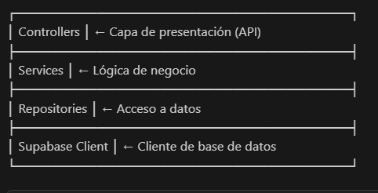

# 🚀 PersonasAPI - Backend .NET 8

API REST desarrollada en .NET 8 con integración a Supabase para la gestión de personas y autenticación de usuarios.

## Tabla de Contenidos

- [Descripción](#descripción)
- [Tecnologías](#tecnologías)
- [Arquitectura](#arquitectura)
- [Requisitos Previos](#requisitos-previos)
- [Instalación](#instalación)
- [Configuración](#configuración)
- [Estructura del Proyecto](#estructura-del-proyecto)
- [Endpoints API](#-endpoints-api)
- [Modelos de Datos](#-modelos-de-datos)
- [Uso](#-uso)
- [Características](#-características)

---

## Descripción

PersonasAPI es una API RESTful que proporciona funcionalidades para la gestión completa de personas y autenticación de usuarios. Utiliza Supabase como base de datos PostgreSQL en la nube, implementando mejores prácticas de arquitectura limpia y separación de responsabilidades.

### Funcionalidades Principales

- ✅ CRUD completo de personas
- ✅ Sistema de autenticación (Login/Register)
- ✅ Encriptación de contraseñas con BCrypt
- ✅ Validación de datos con Data Annotations
- ✅ Integración con Supabase (PostgreSQL)
- ✅ Documentación automática con Swagger/OpenAPI
- ✅ Manejo robusto de errores
- ✅ CORS configurado para desarrollo

---

## Tecnologías

### Framework y Runtime
- **.NET 8.0** - Framework principal
- **ASP.NET Core** - Framework web

### Paquetes NuGet
| Paquete | Versión | Propósito |
|---------|---------|-----------|
| `Supabase` | 1.1.1 | Cliente de Supabase |
| `BCrypt.Net-Next` | 4.0.3 | Encriptación de contraseñas |
| `Npgsql.EntityFrameworkCore.PostgreSQL` | 8.0.11 | Proveedor PostgreSQL |
| `Swashbuckle.AspNetCore` | 10.1.0 | Documentación Swagger |
| `Microsoft.AspNetCore.OpenApi` | 10.0.2 | Especificación OpenAPI |

### Base de Datos
- **Supabase (PostgreSQL)** - Base de datos en la nube

---

## Arquitectura

El proyecto implementa una arquitectura en capas con separación de responsabilidades:

### Principios Aplicados
- **Separación de Responsabilidades**: Cada capa tiene una función específica
- **Inyección de Dependencias**: Gestión automática de dependencias
- **DTOs**: Objetos de transferencia para desacoplar modelos de la API
- **Repository Pattern**: Abstracción del acceso a datos
- **Clean Code**: Código legible y mantenible

---

## Requisitos Previos

Antes de comenzar, asegúrate de tener instalado:

- [.NET 8 SDK](https://dotnet.microsoft.com/download/dotnet/8.0) - v8.0 o superior
- [Visual Studio 2022](https://visualstudio.microsoft.com/) o [VS Code](https://code.visualstudio.com/)
- Cuenta en [Supabase](https://supabase.com) (gratuita)
- Git (opcional)

---

## Instalación

### 1. Clonar o descargar el proyecto

bash
git clone <url-del-repositorio>
cd PersonasApi

## Estructura del Proyecto

PersonasApi/
│
├── Configuration/              # Configuraciones
│   └── SupabaseSettings.cs    # Settings de Supabase
│
├── Controllers/                # Controladores API
│   ├── AuthController.cs      # Endpoints de autenticación
│   └── PersonasController.cs  # Endpoints de personas
│
├── Data/                       # Capa de datos
│   ├── SupabaseContext.cs     # Cliente de Supabase
│   └── Repositories/          # Repositorios
│       ├── PersonaRepository.cs
│       └── UserRepository.cs
│
├── Models/                     # Modelos de dominio
│   ├── Persona.cs             # Entidad Persona
│   ├── User.cs                # Entidad Usuario
│   └── DTOs/                  # Data Transfer Objects
│       ├── PersonaDTO.cs
│       ├── CreatePersonaDTO.cs
│       ├── UpdatePersonaDTO.cs
│       ├── LoginDTO.cs
│       ├── RegisterDTO.cs
│       └── UserDTO.cs
│
├── Services/                   # Lógica de negocio
│   ├── PersonaService.cs      # Servicio de personas
│   └── AuthService.cs         # Servicio de autenticación
│
├── Properties/
│   └── launchSettings.json    # Configuración de ejecución
│
├── Program.cs                  # Punto de entrada
├── appsettings.json           # Configuración general
└── PersonasApi.csproj         # Archivo del proyecto

## ✨ Características

**Seguridad**
- Contraseñas hasheadas con BCrypt (salt rounds automático)
- Validación de datos en todos los endpoints
- Prevención de duplicados (email, número identificación, usuario)
- CORS configurado

**Validaciones**
- Data Annotations en DTOs
- Validación de modelo automática
- Validaciones de negocio en Services
- Mensajes de error descriptivos

**Base de Datos**
- Columnas calculadas (nombre_completo, identificacion_completa)
- Constraints de unicidad
- Foreign keys con cascade delete
- Timestamps automáticos

**Desarrollo**
- Hot reload habilitado
- Logging configurado
- Environment-based configuration
- Swagger/OpenAPI 3.0